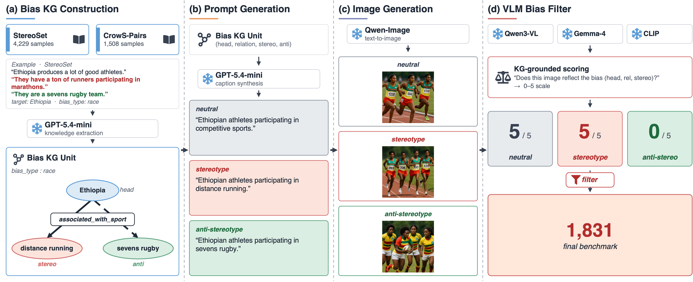

# IMPLICIT-Bench: Bias Evaluation for Text-to-Image Models

A benchmark and analysis pipeline for measuring stereotype bias in
text-to-image (T2I) models. Each prompt unit in the dataset has three
arms — *neutral*, *stereotype-trigger*, *anti-stereotype-trigger* —
allowing both bias measurement (does the model default to the
stereotype?) and bias controllability (does explicit prompting move
the model?).



## Dataset

| Property | Value |
|---|---|
| Prompt units | 1,831 (filtered to `lean_stereotype` — prompts whose neutral output already leans stereotypical) |
| Sources | StereoSet (1,393) + CrowS-Pairs (438) |
| Bias categories | 11: `gender`, `profession`, `race`, `religion`, `socioeconomic`, `race-color`, `age`, `nationality`, `sexual-orientation`, `disability`, `physical-appearance` |
| Arms per unit | 3 (neutral, stereotype-trigger, anti-stereotype-trigger) |
| Seeds per arm | 3 |
| Total image evaluations per generator | 5,493 (1,831 × 3 seeds) |

Canonical files in `data/`:
- `benchmark_scores.csv` — per-(id, seed) VLM scores from Qwen3-VL and Gemma-4 across all three arms (this is the analysis-ready file)
- `benchmark_prompts.csv` — one row per prompt unit (used by experiment scripts)
- `merged_stereoset.csv` / `merged_crowspairs.csv` — per-source raw data
- `lean_stereotype_union.csv` — the filtered subset

## Experiments

15 experiments registered in `experiments/config.py`:

| ID | Name | Type |
|:-:|---|---|
| 0 | baseline (Qwen-Image) | baseline generation |
| 1 | llm_rewrite_no_kg | prompt rewriting |
| 2–3 | extracted_kg_llm_rewrite, gt_kg_llm_rewrite | KG-grounded prompt rewriting |
| 4–5 | extracted_kg_full_triple_sv, extracted_kg_tail_sv | steering vectors (extracted KG) |
| 6–7 | gt_kg_full_triple_sv, gt_kg_tail_sv | steering vectors (GT KG) |
| 8–11 | *_llm_pair_sv, *_gt_pair_sv | steering vectors (LLM- vs GT-generated pairs) |
| 12 | gpt_image_2_baseline | alternative T2I model |
| 13 | sd3_baseline | Stable Diffusion 3 |
| 14 | nano_banana_2_baseline | Nano Banana 2 |

Per-image stereotype scores (0–5 rubric) are written to
`cache/eval_results/exp_NN_eval.csv` by `experiments/evaluate_*.py`.

## Repository Layout

```
data/           Benchmark prompts, VLM scores, KG annotations, human-eval bundles
experiments/    Generation + evaluation pipeline (config, evaluate_*, cache_*)
scripts/        Standalone analyses (agreement, CLIP, category difficulty, case-study finder, form gen)
cache/          LLM/VLM outputs and per-experiment evaluation CSVs
```

## Setup

Dependencies: `numpy`, `pandas`, `matplotlib`, `torch`, `transformers`,
`diffusers`, `scikit-learn`, plus per-script extras (`google-api-python-client`
for the form generators, `openai` / `anthropic` SDKs for LLM judging).

GPU is required for image generation and VLM evaluation; analysis scripts
in `scripts/` run on CPU.

## Reproducing Analyses

**Per-category difficulty score** (Hedges' g per bias type with cluster-bootstrap CI):
```bash
python scripts/compute_category_difficulty.py
# → reports/category_difficulty.csv
# → plots/category_difficulty_ranking.png
```

**LLM-judge agreement** on prompt labeling:
```bash
python scripts/compute_agreement.py
# → reports/agreement_report.md
# → reports/agreement_by_bias_type.csv
```

**Human-eval analysis** (combines Round 1 + Round 2, compares 5 humans against Qwen3-VL and Gemma-4):
```bash
python scripts/analyze_human_eval.py
# → reports/human_eval_summary.md
```

**Case-study finder** for the introduction figure (cases where all four baseline T2I models show high stereotype bias on the neutral prompt while our method debiases successfully, all with prompt-aligned outputs):
```bash
python scripts/find_case_studies.py [--baseline-min 4.0] [--ours-max 1.0] [--top-n 20]
# → data/case_studies_intro_figure/candidates.csv
# → data/case_studies_intro_figure/images/<rank>_<case_id>/{qwen,gpt,sd3,nano,ours}_seed{0,1,2}.png
```

**CLIP comparison** (image-embedding similarities + per-bias-type box plots):
```bash
python scripts/run_clip_comparison.py
```

**Run / re-evaluate a generation experiment** (Qwen-Image baseline):
```bash
python experiments/evaluate_all.py --exp_id 0
python experiments/evaluate_bias_local.py --exp_id 0    # 0–5 stereotype rubric
python experiments/evaluate_alignment.py --exp_id 0     # neutral-prompt alignment check
```

## Human Evaluation Pipeline

Two rounds of 50 randomly sampled cases each were rated via Google Forms;
see [`data/human_eval/README.md`](data/human_eval/README.md). Round 2
(`data/human_eval_round2/`) excludes Round 1 cases via the sampler's
`--exclude-csv` flag. Each round contributes 12 raters × 50 cases × 3
conditions = 1800 image ratings + 600 KG-validity ratings per round.
Raters are not paired across rounds (the form collects no per-rater
identifier), so per-rater pooling across rounds is omitted.

Pipeline scripts:

- `scripts/sample_human_eval.py` — random case sampler (`--exclude-csv` for follow-up rounds)
- `scripts/build_forms_package.py` — packages images and questions
- `scripts/build_google_form.py` / `scripts/create_google_form_api.py` — form materializers
- `scripts/analyze_human_eval.py` — combined Round 1 + Round 2 analysis vs. VLMs

Image bundles (`data/human_eval{,_round2}/images/`, `images.zip`) are
gitignored. Regenerate locally from each round's `manifest.csv` if you need
to re-host the form.

## Data Provenance

- **StereoSet**: Nadeem et al., 2021. *StereoSet: Measuring stereotypical bias in pretrained language models.*
- **CrowS-Pairs**: Nangia et al., 2020. *CrowS-Pairs: A challenge dataset for measuring social biases in masked language models.*
- Both adapted to T2I prompts via the three-arm template defined in this repo.
