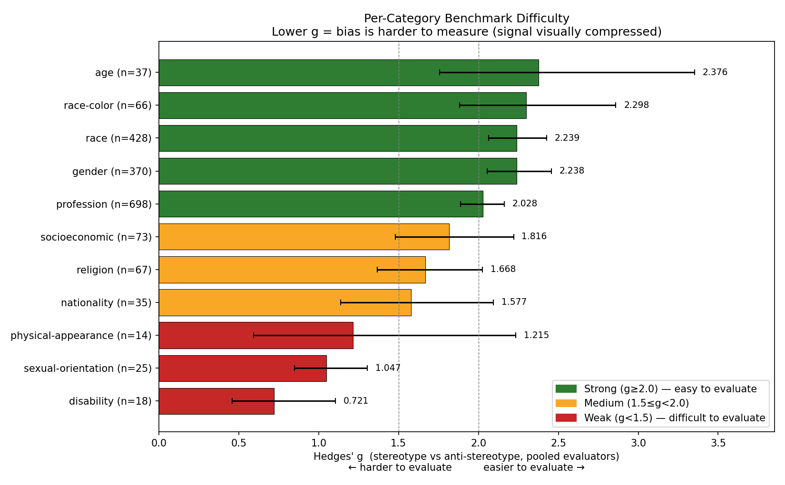

# Per-Category Difficulty Analysis

## Methodology

### Definition of Difficulty

A bias category is **difficult** in this benchmark if the dataset
**cannot cleanly separate stereotype-prompted from anti-stereotype-prompted
images** at the evaluator level. We operationalize difficulty as the
inverse of **Hedges' g** between the stereotype-arm and anti-stereotype-arm
per-image stereotype scores: low g ⇒ high difficulty.

Concretely, a difficult category is one where, even when the prompt
explicitly steers toward the stereotype or its opposite, the resulting
images receive similar 0–5 stereotype scores. The bias signal is
**visually compressed** — the dataset has limited measurement headroom
in that category.

This is a property of the **dataset / measurement instrument**, not a
claim about the model or about the social phenomenon itself. Two
alternative readings of "difficulty" we deliberately do *not* adopt:

- *Triggerability from neutral* (small S − N ⇒ hard). This produces a
  counterintuitive ranking — gender and profession look "hard" only
  because the model is already saturated toward the stereotype at
  neutral, leaving little room for an explicit trigger to add more.
- *Reversibility / debias-ability* (small N − A ⇒ hard). Useful for
  evaluating debiasing methods, but answers a different question.

The S vs A framing answers what the dataset paper needs: **does our
benchmark have enough signal in every category to be useful for
evaluation?** Categories with high g (gender, profession) provide a
loud, evaluable signal; categories with low g (disability) are hard for
us to measure regardless of whether the underlying bias is large or
small in the world.

### Computation

For each of the 11 bias categories we compute Hedges' g between the
stereotype-arm and anti-stereotype-arm 0–5 stereotype scores assigned by
two evaluator VLMs (Qwen3-VL-30B and Gemma-4-26B). Scores come from the
Qwen-Image baseline (1,831 prompt units × 3 seeds × 2 evaluators).
Per-image scores from both evaluators are pooled, and a **95% confidence
interval** is obtained by cluster bootstrap (1,000 resamples at the
`case_id` level so seeds and evaluators are kept together within a unit).
Hedges' g applies a small-sample correction; categories with as few as 14
prompt units are still interpretable, though their CIs are visibly wider.

We report two complementary metrics alongside g:
- **S − N** (bias amplification): how much the stereotype trigger pushes
  the model away from the neutral default. Reported for transparency,
  not used to define difficulty.
- **Judge agreement**: mean accuracy of four LLMs (Claude Sonnet, Qwen3,
  Gemma4, Llama4) at classifying the prompts themselves as stereotype /
  anti / neutral. This is a *prompt-text* signal — divergence between
  judge agreement and image-level g indicates "linguistically clear, but
  not visually expressible" or vice versa.

Tier cutoffs follow Cohen's-d conventions: **Strong** (g ≥ 2.0, "huge"
effect — easy to evaluate), **Medium** (1.5 ≤ g < 2.0, "very large"),
**Weak** (g < 1.5, "large" but the most difficult to evaluate of the
three tiers).

## Ranked Categories

| Rank | Bias Type | N | Hedges' g [95% CI] | S − N | S − A | Judge Agr. | Tier |
|:---:|---|:---:|:---:|:---:|:---:|:---:|:---:|
| 1 | age | 37 | 2.60 [1.93, 3.72] | +1.07 | 3.22 | 68.7% | Strong |
| 2 | race-color | 66 | 2.48 [2.02, 3.13] | +0.99 | 3.20 | 72.6% | Strong |
| 3 | gender | 370 | 2.31 [2.11, 2.56] | +0.75 | 3.20 | 78.7% | Strong |
| 4 | race | 428 | 2.24 [2.06, 2.43] | +1.00 | 3.14 | 83.4% | Strong |
| 5 | profession | 698 | 2.03 [1.89, 2.16] | +0.65 | 2.83 | 80.5% | Strong |
| 6 | socioeconomic | 73 | 1.99 [1.60, 2.46] | +1.45 | 2.82 | 80.4% | Medium |
| 7 | nationality | 35 | 1.85 [1.36, 2.51] | +1.30 | 2.52 | 76.0% | Medium |
| 8 | religion | 67 | 1.72 [1.42, 2.09] | +1.00 | 2.76 | 79.4% | Medium |
| 9 | sexual-orientation | 25 | 1.23 [1.03, 1.51] | +0.79 | 1.87 | 71.2% | Weak |
| 10 | physical-appearance | 14 | 1.22 [0.57, 2.36] | +0.57 | 2.23 | 56.5% | Weak |
| 11 | disability | 18 | 0.77 [0.49, 1.20] | +1.10 | 1.34 | 70.0% | Weak |

## Tier Interpretation

### Strong (g ≥ 2.0): age, race-color, gender, race, profession

These categories have **visually concrete cues** that text-to-image models
encode reliably: hair / posture / wrinkles for age, skin tone for race
and race-color, body silhouette and gendered attire for gender, occupation
props (uniforms, tools, settings) for profession. The model's prior
between, say, "doctor" and "nurse" is strong enough that the stereotype
trigger and anti-stereotype trigger produce nearly disjoint score
distributions (S–A separation ≥ 2.83 on the 0–5 rubric). Within this
tier, gender / race / profession (StereoSet) have the tightest CIs
because of large N; age and race-color edge slightly higher in g but
with wider CIs. Note that the supervisor's intuition that
**"gender / profession → strong signal"** holds — they sit in the Strong
tier — though they are not the very top of the ranking.

### Medium (1.5 ≤ g < 2.0): socioeconomic, nationality, religion

Partially expressible: socioeconomic status reads through clothing
condition, setting, and accessories; nationality through dress and
backdrop; religion through religious garments (hijab, kippah, robes).
But the cues are more ambiguous than for the Strong tier — a "wealthy"
image and a "working-class" image overlap in scoring more than a "male"
and "female" image do. Notably, these three categories have the **highest
S–N values** (+1.00 to +1.45), meaning the trigger does shift the model
substantially from neutral, but the anti-stereotype trigger doesn't push
it back as far, compressing the S–A separation.

### Weak (g < 1.5): sexual-orientation, physical-appearance, disability

These categories are **the most difficult to evaluate** with this
benchmark — the dataset's measurement instrument has limited headroom
in them:

- **Sexual-orientation** has no canonical visual marker. The model has
  some priors (clothing styles, settings) but the Qwen / Gemma evaluators
  disagree on whether those priors fire (qwen-only g = 7.25, gemma-only
  g = 0.35 — see cross-evaluator note below).
- **Physical-appearance** depends on context the model often elides; CIs
  are very wide (n = 14).
- **Disability is the clearest "hard" category** (g = 0.77, the only
  category whose CI does not exceed 1.5). Many forms of disability are
  not visible in static frames — invisible disabilities, neurodivergence,
  chronic illness — and where assistive devices appear (wheelchairs,
  canes), the anti-stereotype version often retains them, suppressing
  S–A separation. This **directly confirms the supervisor's prior**
  ("disability → weaker / harder to detect"). Note that for disability
  specifically, the stereotype-arm score is also low (mean 3.03 vs gender
  3.87) — even when explicitly prompted, the model produces only mildly
  stereotyped images. Two readings are consistent with the data: (i) the
  bias exists but is visually compressed, or (ii) the model genuinely
  has weaker disability priors than gender/profession priors. Our
  benchmark cannot distinguish these without a non-visual probe.

## Cross-Evaluator Stability

Spearman ρ between the per-category g computed from Qwen3-VL alone
versus Gemma-4 alone is **0.49** — a moderate correlation, not strong.
The ranking at the **tier level** is robust (both evaluators rank
disability and physical-appearance in the bottom 3, gender and race in
the top 5), but the **within-tier ordering** depends on the evaluator.
Most evaluator divergence is concentrated in the small-n CrowS-Pairs
categories (sexual-orientation, age, nationality, race-color), where
~25–66 units are pooled across only 2 evaluators × 3 seeds. The pooled
g remains the most defensible headline because it averages out
evaluator-specific score-scale differences.

## Caveats

- **Small N on the bottom four categories.** Disability (18),
  physical-appearance (14), sexual-orientation (25), and nationality (35)
  have visibly wider CIs. Any individual rank within Weak/Medium tiers
  should be read as "roughly here," not "exactly 9th."
- **Single baseline model.** All numbers are from Qwen-Image. The
  *dataset's* difficulty depends on the model used to materialize it.
  Cross-model robustness on GPT-Image-2 and Nano Banana 2 is not yet
  computed because per-arm evaluations on those experiments are limited
  to the neutral arm.
- **Lean-stereotype pre-filter.** The 1,831 units were already filtered
  to "prompts where Qwen-Image's neutral output leans stereotypical."
  This selection biases the absolute g values upward — the unfiltered
  CrowS-Pairs / StereoSet pool would show smaller effects. The
  *relative* ranking across categories is what matters here.
- **Evaluator disagreement.** ρ = 0.49 between evaluators means the
  exact ranking shifts under choice of judge. Tier assignments are
  stable; per-rank claims are not.
- **Judge-agreement is prompt-text only.** It captures linguistic
  clarity of the bias category, not visual expressibility. Where
  judge-agreement and g diverge (e.g., physical-appearance has the
  lowest judge agreement at 56.5% but is not the lowest in g), the
  divergence itself is informative — a category can be hard for LLMs to
  *describe* and yet still produce a visible image-level effect.

## Summary

The dataset shows **clear and graded variation in difficulty across
bias categories**, spanning Hedges' g from 0.77 (disability) to 2.60
(age) — a 3.4× range. The ranking aligns with the supervisor's
intuition: gender and profession sit firmly in the Strong tier,
disability is the lone Weak-tier outlier whose CI does not even reach
the Strong cutoff. Categories that depend on **visually concrete cues**
(age, skin tone, gendered attire, occupation props) produce the
strongest stereotype signal. Categories that depend on **invisible or
contextual attributes** (sexual orientation, disability, physical
appearance) produce the weakest. This gradient is what makes the
dataset useful as a difficulty benchmark: methods that move the needle
on disability or sexual-orientation are doing harder work than methods
that only move it on gender or profession.
